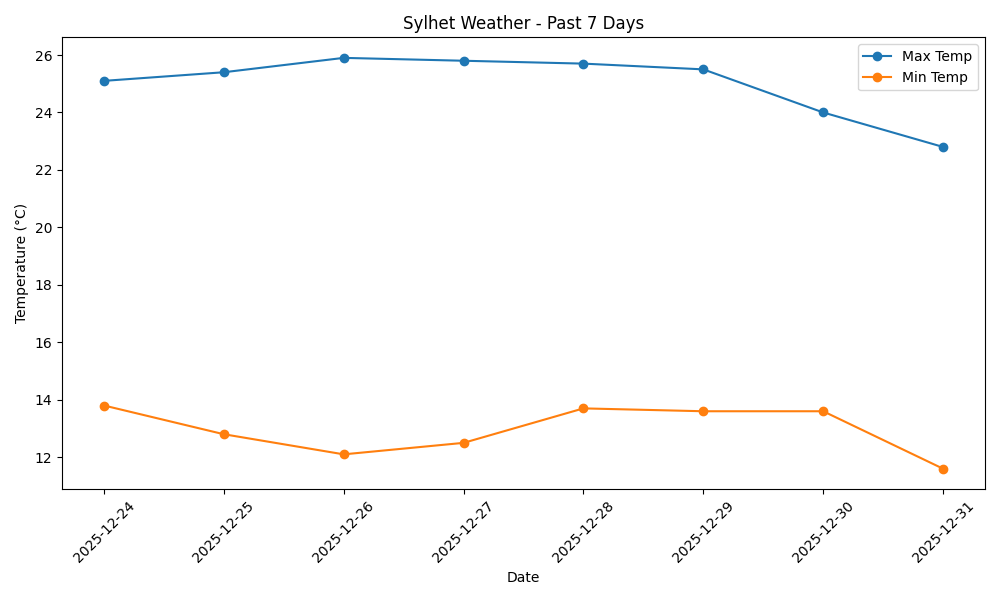

# 🌤️ Sylhet Weather Forecast Visualizer

A Python script that fetches real-time weather data for **Sylhet, Bangladesh** using the Open-Meteo API and visualizes the forecast for the next 7 days.

## 📊 Output Preview

*(This chart shows the forecasted Maximum and Minimum temperatures for the coming week)*

## 🚀 Features
* **Live Data Fetching:** Pulls real-time forecast data from the [Open-Meteo API](https://open-meteo.com/) (no API key required).
* **Dynamic Dates:** Automatically calculates the forecast range from "Today" to 7 days in the future.
* **Data Processing:** Uses `pandas` to structure raw JSON data into a clean DataFrame.
* **Visualization:** Generates a clear, dual-line graph using `matplotlib` to compare daily temperature highs and lows.

## 🛠️ Prerequisites
Ensure you have Python installed. The project relies on the following external libraries:

* `requests` (for making API calls)
* `pandas` (for data manipulation)
* `matplotlib` (for plotting the graph)

### Installation
Run the following command in your terminal to install the required packages:

```bash
pip install requests pandas matplotlib
